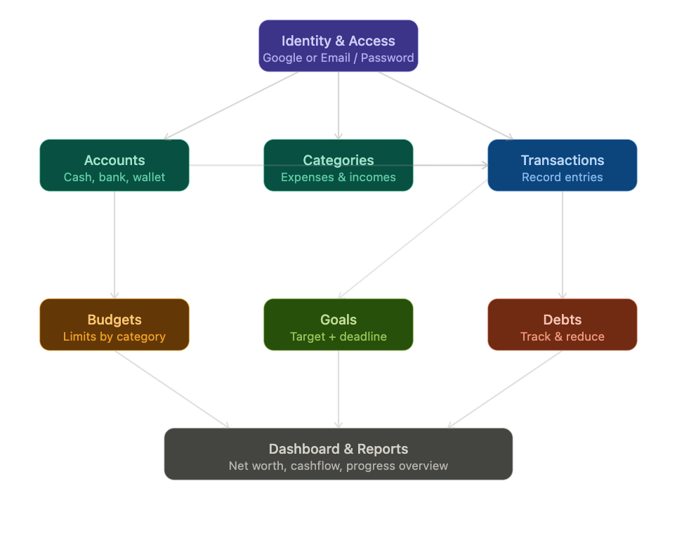

# Ledger — Personal Finance Manager

> A privacy-first money manager that gives individuals full visibility and control over their financial life across accounts, categories, budgets, goals, and debts — all in one place.

---

## Product Design Document

### Vision

A unified personal finance platform that gives individuals **complete visibility and control** over their money — where it comes from, where it goes, what they owe, and what they're building toward.

## **Key Promise:** No bank integrations required. _The user is the source of truth._

## Module 1 — Identity & Access

Users create an account using either **Google (OAuth)** or **email/password**. The authentication layer is the gateway to all personal data and must feel frictionless on first use.

### Requirements:

- Sign up and sign in via Google OAuth
- Sign up and sign in via email and password (with email verification)
- Password reset via email link
- One user, one account — no multi-user households in v1
- All financial data is private to the authenticated user

---

## Module 2 — Accounts

A user can represent **all places where money lives**. These are not bank integrations — they are manual accounts the user creates and names themselves.

### Requirements:

- Create multiple accounts (e.g., Cash, Visa, BCP Bank, Savings)
- Each account has a name, type (cash, bank, credit card, digital wallet), and initial balance
- Balances update automatically as transactions are recorded
- Accounts can be archived but not deleted if they have transactions
- View balance history per account over time

---

## Module 3 — Categories & Subcategories

The **classification system** for all money movement. Categories are user-defined and fully customizable.

### Requirements:

- Create top-level categories of two types: **Expense** or **Income**
- Create subcategories beneath any category (one level deep in v1)
  - _Example:_ Food → Groceries, Food → Restaurants; Salary → Freelance, Salary → Main Job
- Categories can be renamed or archived; archived categories are preserved on historical records
- Default starter categories provided on sign-up (user can edit or delete)
- Visual icon or color per category to aid scanning in lists

---

## Module 4 — Transaction Records

The **core data entry** of the product. Every movement of money is logged as a transaction.

### Requirements:

- Record an **expense** (money out) or **income** (money in)
- Each transaction requires: date, amount, account, category/subcategory, and optional note
- Transactions can be edited or deleted after creation
- Support for **transfers** between accounts (moves balance without affecting budget categories)
- List view of all transactions with filters by:
  - Date range
  - Account
  - Category
  - Type (income/expense)
- Search transactions by note text

---

## Module 5 — Budgets

Budgets give users a **spending ceiling** per category for a given time period, with real-time feedback on spending.

### Requirements:

- Create a budget for any expense category or subcategory
- Budget defined per period: **monthly** (v1), with weekly/yearly in later versions
- Budget shows: limit set, amount spent, amount remaining, and visual progress bar
- Status states: on track | approaching limit (>80% used) | over budget
- Budgets reset automatically at the start of each new period
- In-app alert when a budget is exceeded
- Summary view of all budgets for the current period at a glance

---

## Module 6 — Goals

Goals represent something the user is **actively saving toward** — a vacation, an emergency fund, a new device. Unlike budgets (which are limits), goals are targets the user builds up to over time.

### Requirements:

- Create a goal with: name, target amount, target date, and optional description
- Goals have a current saved amount that starts at zero
- User makes deposits toward a goal (manual entries, separate from regular transactions)
- Each deposit reduces the remaining gap
- Goal shows: target amount, saved so far, remaining, percentage complete, and projected completion date
- Goal status: in progress | achieved | overdue (past target date without completion)
- Achieved goals are archived and visible in history view
- _Optional:_ Link a goal to a specific account so money is conceptually "reserved" there

---

## Module 7 — Debts

Debts represent money the user currently owes — a loan, a credit balance, money borrowed from a friend. The module helps the user **track and reduce each debt systematically**.

### Requirements:

- Create a debt with: name, creditor (who is owed), original amount, current balance, optional interest rate, and optional due date
- User records payments against a debt (which reduce the current balance)
- Debt shows: original amount, total paid so far, current remaining balance, and paydown progress bar
- Status: active | paid off
- Paid-off debts are archived with full payment history
- _Optional:_ Minimum payment field and next due date as a reminder
- Debts are separate from transaction records — they are their own entity with their own payment log

---

## Module 8 — Dashboard & Reports

The **home screen and analytics layer** that brings all modules together into a single coherent picture.

### Requirements:

- ✅ **Net Worth Snapshot:** Total assets (sum of all account balances) minus total debts (sum of remaining debt balances)
- ✅ **Monthly Cashflow:** Total income vs. total expenses for the current month
- ✅ **Budget Summary:** How many budgets are on track, approaching, or over
- ✅ **Goals Progress:** Top active goals and their completion percentage
- ✅ **Debt Paydown:** Total remaining debt and recent payments
- ✅ **Recent Transactions:** Last 5–10 entries for quick review
- ✅ **Reports:**
  - Monthly breakdown by category (bar or pie chart)
  - Income vs. expense trend over 3/6/12 months
- ✅ **Data Source:** All user-generated — no external data pulls, no bank sync

---

> **Philosophy:** Full transparency, complete control, zero dependencies on external services.

Cross-Cutting Requirements
Data integrity: Deleting a category, account, or goal should never silently remove historical records. The system should archive or preserve references.
Offline-first mindset: Users should be able to enter transactions even without connectivity; data syncs when connection is restored.
Privacy: All data belongs to the user. No data is sold or used for advertising. Export of all personal data (CSV or JSON) must be available.
Localization: Currency should be selectable per user (symbol and formatting). Dates follow the user's locale. Multi-language support is a v2 priority.
Notifications: In-app alerts for budget overruns and goal deadlines. Push notifications on mobile are a v2 addition.

User Flow Summary

User signs up → sets currency and creates their first accounts
User customizes categories (or uses defaults)
User records daily transactions (income and expenses)
User sets monthly budgets and monitors them in real time
User creates savings goals and makes periodic deposits
User logs existing debts and records payments as they pay them down
User reviews the dashboard weekly/monthly to understand their full financial picture
